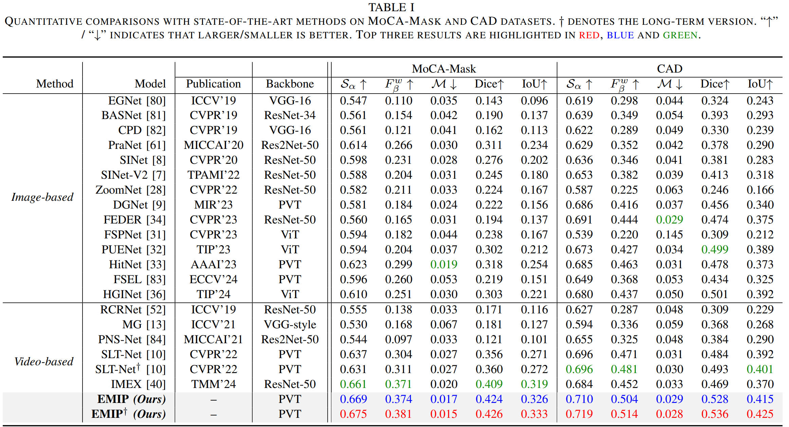

## Explicit Motion Handling and Interactive Prompting for Video Camouflaged Object Detection (IEEE TIP 2025)
This repository contains the code for our paper `Explicit Motion Handling and Interactive Prompting for
Video Camouflaged Object Detection` [[arXiv](http://arxiv.org/abs/2403.01968)] 

<p align="left">
     <br />
    <em>
    Figure 1: Overall architecture of the proposed EMIP, which consists of two separate streams: explicit motion modeling stream (upper) and object segmentation stream (lower). With the camouflage feeder and motion collector, segmentation and motion prompts are injected into each task-specific stream to compensate essential information. The fire/snowflake symbols indicate that the model parameters in this part or block are designated as learnable/frozen.
    </em>
</p>

## 1. Highlights :fire:

- We propose a novel framework for VCOD, dubbed EMIP, which handles motion cues explicitly using a frozen pre-trained optical flow fundamental model. EMIP is formulated into a novel two-stream architecture for simultaneously conducting camouflaged segmentation and optical flow estimation.  
- Inspired by visual prompt learning, the interactions across the two streams are realized in an interactive prompting way, and we propose two modules, **i.e.**, the camouflaged feeder and motion collector, to incorporate segmentation-to-motion and motion-to-segmentation prompts, respectively.
- We also propose a long-term variant of EMIP by formulating historical features into the prompt to mitigate short-term prediction errors.
- EMIP together with its long-term variant, achieve new state-of-the-art records and outperform previous models by notable margins (**~17.0\%/5.5\%** average improvement on **F-measure/S-measure** over the previous best model SLT-Net [Github](https://github.com/XuelianCheng/SLT-Net/tree/master)).

## 2. Preparation :memo:

**Requirements.** 
1. Python 3.8.*
2. CUDA 12.2
3. PyTorch 
4. TorchVision 

**Install.** 

Install MMCV + MMSegmentation

Follow the instructions [here](https://mmcv.readthedocs.io/en/latest/get_started/installation.html). MMCV and MMSegmentation are required for training the transformer encoder. A quick installation example:

```shell
pip install mmcv-full -f https://download.openmmlab.com/mmcv/dist/cu111/torch1.9.0/index.html
pip install mmsegmentation
```

**Dataset.** 
To evaluate/train our EMIP, you will need to download the required datasets.

* [MoCA-Mask](https://drive.google.com/file/d/1FB24BGVrPOeUpmYbKZJYL5ermqUvBo_6/view?usp=sharing)
* [CAD2016](http://vis-www.cs.umass.edu/motionSegmentation/)
* [COD10K](https://drive.google.com/file/d/1vRYAie0JcNStcSwagmCq55eirGyMYGm5/view)

## 3. Main Results :balloon:

**Training.**

All hyperparameters for model training and inference are located in the `configs/configs.py` file, with corresponding comments for explanation. To start training, run the following code in the command line:

```shell
python train.py # for EMIP
python train_long.py # for long-version of EMIP
```

**Prediction.** 
You can evaluate a trained model using `test.py` for each dataset, which would help you generate *.png images corresponding to different datasets.

```shell
python test.py # for EMIP
python test_long.py # for long-version of EMIP
```

**Evaluation.** 
Please run the file  `run_eval.sh`  in `eval` folder to evaluate your model. You could also simply download the images via this [Link](https://drive.google.com/drive/folders/11ECI7T9gFVqjEHZ447J60BSq2MFZh4-2?usp=sharing) to reach the results reported in our paper. Or download our pre-trained model via this link: [snapshot](https://drive.google.com/file/d/1hg-lyRFVibX-mbIWkNyKSYX9yqi65Ak9/view?usp=sharing).

**Quantitative comparisons with state-of-the-arts.** 

<div align=center>

</div>


**Visual comparisons with state-of-the arts.** 

<div align=center>

</div>

**Acknowledgements.** 
Many thanks to following codes that help us a lot in building this codebase:

- [MMCV](https://github.com/open-mmlab/mmcv)
- [SLT-Net](https://github.com/XuelianCheng/SLT-Net)
- [GMFlow](https://github.com/haofeixu/gmflow)

## 4. Demo videos :video_camera:

We demonstrate the video results of our SLT-Net with previous state-of-the-art model SLT-Net on MoCA-Mask test dataset.


## 5. Citing  EMIP 🤗

If you find EMIP useful in your research, please consider giving a star ⭐ and citing:
```shell
@article{zhang2025emip,
  title={Explicit Motion Handling and Interactive Prompting for Video Camouflaged Object Detection}, 
  author={Zhang, Xin and Xiao, Tao and Ji, Ge-Peng and Wu, Xuan and Fu, Keren and Zhao, Qijun},
  journal={IEEE Transactions on Image Processing}, 
  volume={34},
  pages={2853-2866},
  year={2025}
}
```

## 6. Contact :email:

If you have any questions while using EMIP or would like to further discuss implementation details with us, please `leave a message on issues` or contact us directly via email: `zhangxinchina1314@gmail.com`. We will reply as soon as possible.
